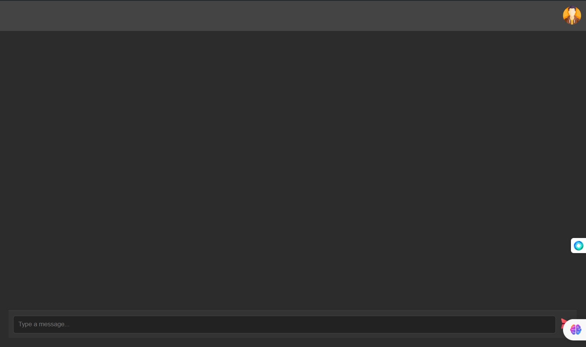
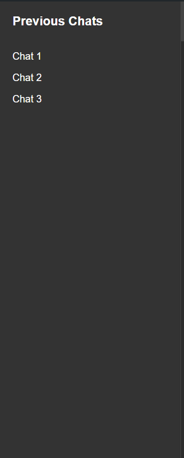
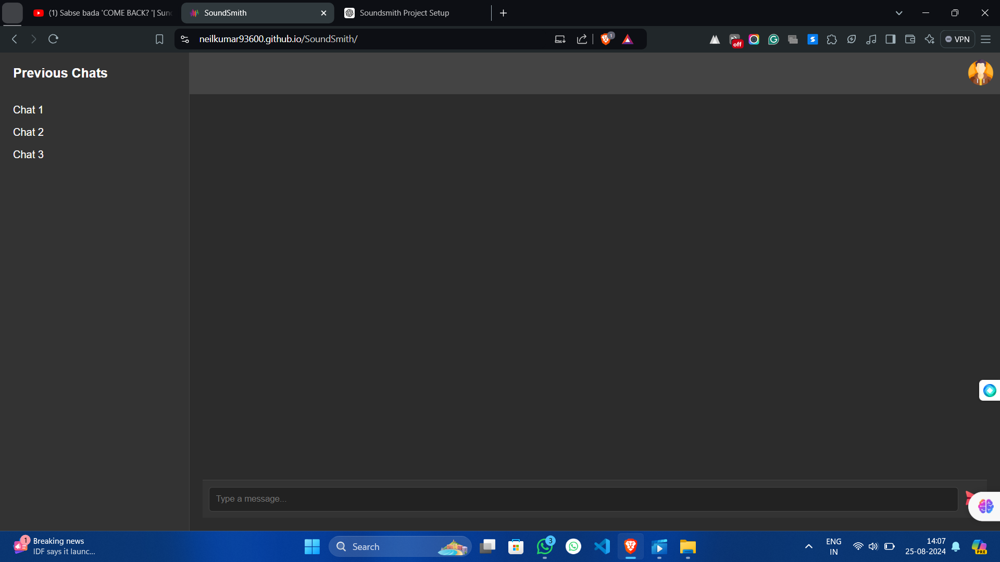

# SoundSmith

**SoundSmith** is a modern, music-generation web application developed using **ReactJS** and **Tailwind CSS**. The project is designed to provide an intuitive and engaging user experience, closely resembling the layout of ChatGPT, with a dark theme that enhances usability and aesthetics.

## Table of Contents

- [Introduction](#introduction)
- [Features](#features)
- [Project Structure](#project-structure)
- [Technologies Used](#technologies-used)
- [Screenshots](#screenshots)
- [Getting Started](#getting-started)
- [Installation](#installation)
- [Usage](#usage)
- [Deployment](#deployment)
- [Contributing](#contributing)
- [License](#license)
- [Acknowledgements](#acknowledgements)

## Introduction

SoundSmith is an innovative web application designed for music enthusiasts who want to explore AI-generated music in an interactive and user-friendly environment. The application mimics the ChatGPT layout, providing users with an engaging chat interface to generate and manage music. With a focus on simplicity and elegance, SoundSmith is built with the latest web technologies, ensuring a smooth and responsive experience across devices.

## Features

- **Dark Themed Interface:** A visually appealing dark theme for comfortable usage during extended periods.
- **AI Chat Interface:** Engage with the AI in a chat format to generate music, making the process interactive and fun.
- **Previous Sessions:** Easily access and revisit your past interactions and generated music using the sidebar.
- **Responsive Design:** The layout adapts to various screen sizes, offering a consistent user experience on both desktop and mobile devices.
- **Simple Authentication:** A minimalistic login/sign-up option for user management, ensuring easy access to personalized features.

## Project Structure

The project is structured to separate concerns and ensure maintainability. Here is an overview:

```bash
soundsmith/
├── public/
│   ├── index.html
│   └── favicon.ico
├── src/
│   ├── assets/
│   │   └── images/     # Images and icons used in the project
│   ├── components/
│   │   ├── ChatBox.js  # Chat interface for user interaction
│   │   ├── Sidebar.js  # Sidebar displaying previous sessions
│   │   └── Header.js   # Header with user profile and settings
│   ├── styles/
│   │   └── index.css   # Global styles using Tailwind CSS
│   ├── App.js          # Main application component
│   ├── index.js        # Entry point of the application
│   └── utils/
│       └── api.js      # API calls for music generation
└── README.md
```

### Components Overview

- **Header.js:** Contains the user profile icon and possible settings or logout options. Positioned at the top right corner of the interface.
- **Sidebar.js:** Displays a list of previous sessions. Users can click on these to revisit and review past interactions.
- **ChatBox.js:** The core component where users type messages and interact with the AI to generate music. Messages from the user and AI are displayed here.

## Technologies Used

- **ReactJS:** A JavaScript library for building user interfaces. React allows for the creation of reusable components and efficient rendering.
- **Tailwind CSS:** A utility-first CSS framework that enables rapid UI development with minimal custom CSS.
- **JavaScript (ES6+):** The main programming language used for developing the application logic.
- **HTML5:** Used for structuring the application.
- **CSS3:** Tailwind is built on top of CSS, and some custom styles are used in this project.
- **GitHub Pages:** The platform used for deploying and hosting the application.

## Screenshots

### Main Interface



The main interface of SoundSmith, where users interact with the AI for music generation. The user message area is on the right, and AI responses appear on the left.

### Sidebar



The sidebar on the left shows previous music sessions, allowing users to quickly access their past interactions.

### Full Layout



A full view of the SoundSmith interface, showcasing both the sidebar and the main chat area.

## Getting Started

To run SoundSmith on your local machine, follow these instructions. This will give you a development environment where you can experiment with and customize the application.

### Prerequisites

Ensure you have the following installed:

- **Node.js**: Version 14 or above.
- **npm**: Node package manager, usually installed alongside Node.js.
- **Git**: For cloning the repository.

### Installation

1. **Clone the repository:**

   ```bash
   git clone https://github.com/your-username/soundsmith.git
   cd soundsmith
   ```

2. **Install dependencies:**

   Install the required npm packages:

   ```bash
   npm install
   ```

3. **Start the development server:**

   ```bash
   npm start
   ```

4. **Open your browser and navigate to:**

   ```
   http://localhost:3000
   ```

   You should now see the SoundSmith interface in your browser.

## Usage

To generate music using SoundSmith, follow these steps:

1. **Login/Sign-up:** If your version includes authentication, start by logging in or signing up.
2. **Start a Chat:** Type a message in the chat box to interact with the AI. You can ask the AI to create music based on certain criteria or simply explore what it generates.
3. **Access Previous Chats:** Use the sidebar to navigate through your past sessions. This feature is particularly useful if you want to refine previously generated music.

## Deployment

To deploy SoundSmith to GitHub Pages, follow these steps:

1. **Build the project:**

   ```bash
   npm run build
   ```

   This will create an optimized production build of the application.

2. **Deploy to GitHub Pages:**

   If you’ve configured the project for GitHub Pages:

   ```bash
   npm run deploy
   ```

   The application will be available at `https://your-username.github.io/soundsmith/`.

## Contributing

We welcome contributions! To contribute:

1. **Fork the repository**
2. **Create a new branch:** `git checkout -b feature-name`
3. **Make your changes**
4. **Commit your changes:** `git commit -m 'Add some feature'`
5. **Push to the branch:** `git push origin feature-name`
6. **Open a pull request**

Please ensure your code adheres to the project’s style guidelines and includes relevant tests.

## License

This project is licensed under the MIT License. See the [LICENSE](./LICENSE) file for more information.

## Acknowledgements

- **ReactJS**: For providing a robust framework to build interactive UIs.
- **Tailwind CSS**: For offering a versatile and efficient styling toolset.
- **GitHub Pages**: For hosting the application.
- **OpenAI**: For inspiring the chat interface layout with ChatGPT.

